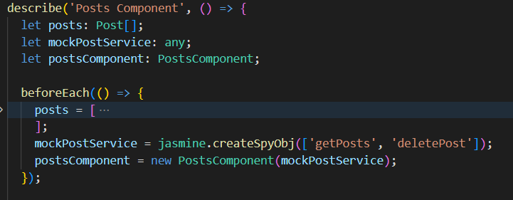
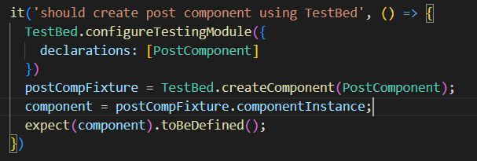
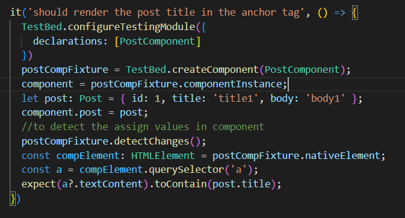

# Notes

**Isolated Testing:** Isolated unit testing refers to the practice of testing individual units of code in isolation, without relying on external dependencies such as databases, network services, or other external systems. The purpose of isolated unit testing is to ensure that each unit of code, typically a function or method, behaves as expected without interference from external factors.

**Mocking:** Mocking is a technique used in isolated unit testing to replace real dependencies with simulated objects that emulate the behavior of the real dependencies. This allows you to isolate the unit under test and control the behavior of its dependencies, making your tests more focused, deterministic, and faster. 

#TestBed
It provides a controlled environment where you can create instances of components, inject dependencies, test angular template
and simulate various scenarios to test the behavior of your Angular application

**TestBed to acess the component instance**

**TestBed to test component template**

# AngularUnitTesting

This project was generated with [Angular CLI](https://github.com/angular/angular-cli) version 13.3.11.

## Development server

Run `ng serve` for a dev server. Navigate to `http://localhost:4200/`. The application will automatically reload if you change any of the source files.

## Code scaffolding

Run `ng generate component component-name` to generate a new component. You can also use `ng generate directive|pipe|service|class|guard|interface|enum|module`.

## Build

Run `ng build` to build the project. The build artifacts will be stored in the `dist/` directory.

## Running unit tests

Run `ng test` to execute the unit tests via [Karma](https://karma-runner.github.io).

## Running end-to-end tests

Run `ng e2e` to execute the end-to-end tests via a platform of your choice. To use this command, you need to first add a package that implements end-to-end testing capabilities.

## Further help

To get more help on the Angular CLI use `ng help` or go check out the [Angular CLI Overview and Command Reference](https://angular.io/cli) page.
